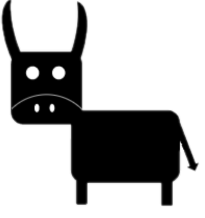
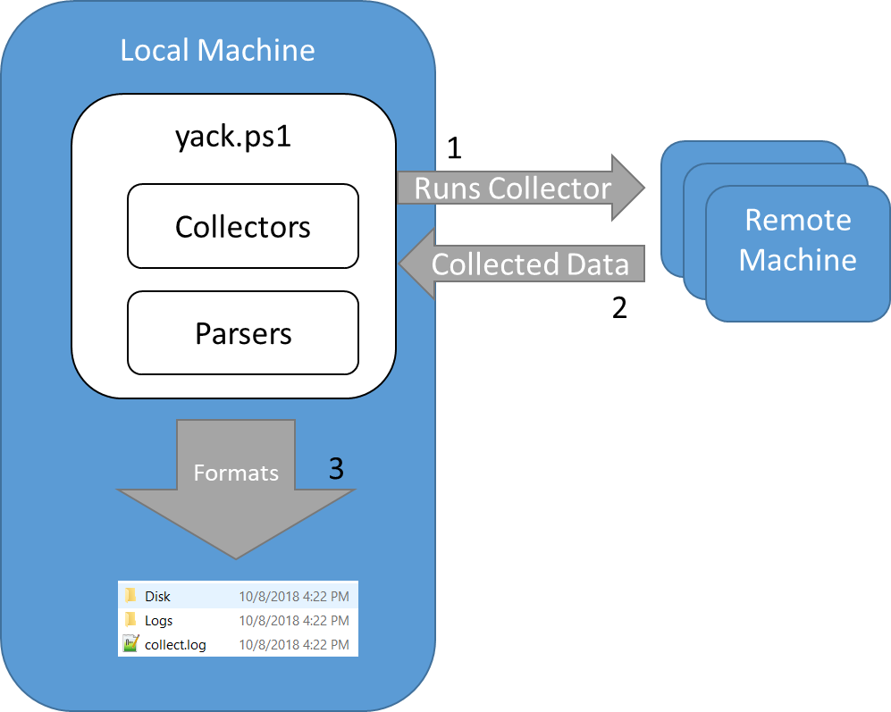

# Deprecaited
No longer updated due to PS 2.0 constraints becoming more and more rare.

# YACK
Yet Another Collection Kick

# Description
YACK is a framework to remotely collect windows forensic items while maintaining powershell 2.0 compatibility. The goal was to ensure maximum compatibility with older versions of Windows. Significant inspiration drawn from Kansa. 

# How it works

### Controller
The controlling script is what manages both the collection of data from endpoints and the parsing of said data. It can run collection against the local host or parallel across multiple remote hosts. After collection you have the option to run additional parsers against the collected data. Both collectors and parsers are configurable through their respective configuration files. 

### Collectors
Collectors are self-contained PowerShell scripts that are ran on the target machine to collect data of interest. The data is returned back to yack over the PSSession session. When data formatting is required, it’s normally done on the remote machine before being returned.

### Parsers
Parsers are self-contained PowerShell scripts that do additional processing of the data which could not be completed on the target systems. An example collector of this is a memory dump, where you want to run additional modules against the results. 

# Additional Help
View UserGuide.docx in Help.

